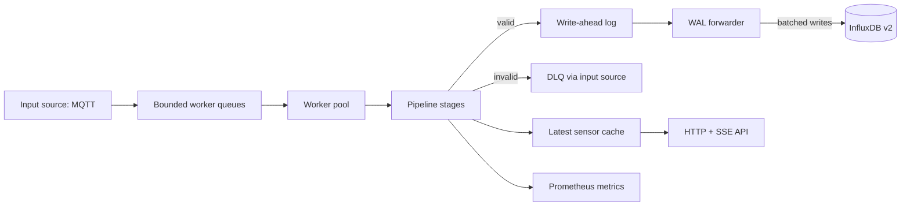

# smarthome-ingest

Performance-focused Rust service for ingesting smart home telemetry from a configurable input source (MQTT today), validating and transforming it, durably staging the active sink payload in a local write-ahead log (WAL), and forwarding batches to the configured output sink (InfluxDB v2 today).

Invalid messages are published to a DLQ on the active input source (MQTT today). The latest sensor state is exposed through HTTP and Server-Sent Events (SSE), and Prometheus metrics are available for scraping.


## What It Does

- Consumes sensor and status payloads via a swappable input source (only MQTT is implemented today, selected with `INPUT_SOURCE`).
- Validates raw JSON with embedded schemas.
- Normalizes messages into canonical Rust structs.
- Computes sensor values such as dew point, heat index, and IAQ.
- Writes a pre-rendered wire-format payload to a local WAL via a swappable output sink (only InfluxDB is implemented today, selected with `OUTPUT_SINK`).
- Retries transient InfluxDB failures without advancing the WAL cursor.
- Publishes rejected payloads to a DLQ destination on the active input source (an MQTT topic today).
- Serves latest sensor state over HTTP and SSE.
- Exposes Prometheus metrics and structured JSON logs.

## Architecture



For the full design, see [docs/architecture.md](docs/architecture.md) and [docs/wal-and-reliability.md](docs/wal-and-reliability.md).

## Quick Start

The service requires an input source (MQTT today), InfluxDB v2, and a writable WAL directory.

Set the required environment:

```bash
INPUT_SOURCE=mqtt
MQTT_HOST=localhost
MQTT_PORT=1883
MQTT_CLIENT_ID=smarthome-ingest
MQTT_TOPIC_SENSOR=smarthome/+/sensor
MQTT_TOPIC_STATUS=smarthome/+/status
MQTT_TOPIC_DLQ=smarthome/_dlq/ingest
OUTPUT_SINK=influx
INFLUX_URL=http://localhost:8086
INFLUX_ORG=smarthome
INFLUX_BUCKET=sensors
INFLUX_TOKEN=change-me
BATCH_SIZE=500
FLUSH_INTERVAL_MS=1000
WAL_DIR=./data/wal
ENFORCE_TOPIC_DEVICE_MATCH=true
METRICS_BIND=0.0.0.0:9090
CACHE_BIND=0.0.0.0:8085
CACHE_TTL_MS=60000
CACHE_BUFFER=1024
```

Run locally:

```bash
cargo run --release
```

Then check:

```bash
curl -i http://localhost:8085/healthz
curl -i http://localhost:8085/readyz
curl http://localhost:8085/v1/state
curl http://localhost:9090/metrics
```

A complete walkthrough is available in [docs/tutorial.md](docs/tutorial.md).

## Docker

The Docker image healthcheck probes `http://localhost:8085/healthz`, so set `CACHE_BIND=0.0.0.0:8085` when running the container.

```bash
docker build -t smarthome-ingest .
```

```bash
docker run --rm \
  -p 8085:8085 \
  -p 9090:9090 \
  -e INPUT_SOURCE=mqtt \
  -e MQTT_HOST=host.docker.internal \
  -e MQTT_PORT=1883 \
  -e MQTT_CLIENT_ID=smarthome-ingest \
  -e MQTT_TOPIC_SENSOR=smarthome/+/sensor \
  -e MQTT_TOPIC_STATUS=smarthome/+/status \
  -e MQTT_TOPIC_DLQ=smarthome/_dlq/ingest \
  -e OUTPUT_SINK=influx \
  -e INFLUX_URL=http://host.docker.internal:8086 \
  -e INFLUX_ORG=smarthome \
  -e INFLUX_BUCKET=sensors \
  -e INFLUX_TOKEN=change-me \
  -e BATCH_SIZE=500 \
  -e FLUSH_INTERVAL_MS=1000 \
  -e WAL_DIR=/app/wal \
  -e ENFORCE_TOPIC_DEVICE_MATCH=true \
  -e METRICS_BIND=0.0.0.0:9090 \
  -e CACHE_BIND=0.0.0.0:8085 \
  -e CACHE_TTL_MS=60000 \
  -e CACHE_BUFFER=1024 \
  -v smarthome-ingest-wal:/app/wal \
  smarthome-ingest
```

## Documentation

Start with [docs/README.md](docs/README.md).

| Need | Document |
|---|---|
| Run the service locally | [docs/tutorial.md](docs/tutorial.md) |
| Configure runtime environment | [docs/configuration.md](docs/configuration.md) |
| Publish compatible MQTT payloads | [docs/messages-and-routing.md](docs/messages-and-routing.md) |
| Use HTTP, SSE, and metrics | [docs/http-and-metrics.md](docs/http-and-metrics.md) |
| Understand WAL behavior | [docs/wal-and-reliability.md](docs/wal-and-reliability.md) |
| Operate the service | [docs/operations.md](docs/operations.md) |
| Develop or extend the service | [docs/development.md](docs/development.md) |
| Release and deploy | [docs/releasing.md](docs/releasing.md) |

## Development

```bash
cargo build
cargo test --all-features --locked
cargo fmt --all --check
cargo clippy --all-targets --all-features --locked -- -D warnings
```

Generate local Rust API docs:

```bash
cargo doc --all-features --no-deps
```

CI runs formatting, clippy, and tests on Rust `1.87.0`.

## License

This project is dual-licensed under either of:

- Apache License, Version 2.0 ([LICENSE-APACHE](LICENSE-APACHE))
- MIT license ([LICENSE-MIT](LICENSE-MIT))

You may choose either license when using, modifying, or distributing this software.
