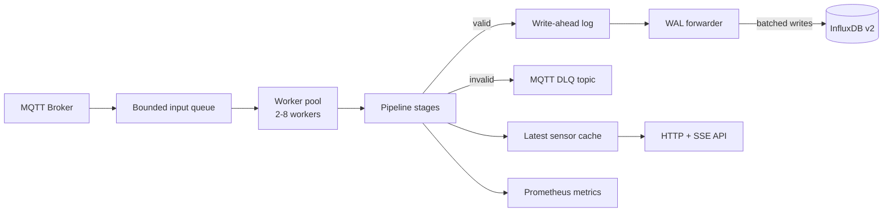

# smarthome-ingest

Performance-focused Rust service for ingesting smart home telemetry from MQTT, validating and transforming it, durably staging writes in a local WAL, and forwarding batched line protocol to InfluxDB v2. Invalid messages are published to an MQTT Dead Letter Queue, while the latest sensor state is exposed over HTTP and SSE.


## Features

- High-throughput MQTT ingestion with bounded queues and a CPU-scaled worker pool
- Sequential validation pipeline for raw schema checks, business rules, and transformations
- Durable write-ahead log between ingest and InfluxDB to absorb downstream outages
- Batched InfluxDB v2 writes with bounded retry behavior
- MQTT DLQ publishing with source topic, timestamp, error, and raw payload
- Latest sensor-state cache with HTTP and Server-Sent Events endpoints
- Prometheus metrics and structured JSON logging

## Architecture



### Pipeline stages

| # | Stage | Responsibility |
|---|---|---|
| 1 | `decode` | Rejects payloads larger than 64 KiB, decodes UTF-8, parses JSON |
| 2 | `validate_raw` | Validates against the raw JSON schema, checks `time_iso`, optionally enforces MQTT topic vs. `device_id` |
| 3 | `transform` | Trims string fields, computes `dew_point_c`, `heat_index_c`, `iaq_score`, `iaq_text`, and validates transform-safe bounds |
| 4 | `validate_business` | Validates the transformed payload against business schemas |
| 5 | `cache_update` | Updates the in-memory latest sensor cache |
| 6 | `persist` | Renders Influx line protocol and appends it durably to the WAL |
| 7 | `observe` | Emits Prometheus counters and histograms |
| 8 | `dlq_publish` | Publishes failures to the configured DLQ topic |

### Reliability model

- The ingest side writes pre-rendered Influx line protocol to the WAL before acknowledging pipeline success.
- The forwarder flushes to InfluxDB when `BATCH_SIZE` is reached or `FLUSH_INTERVAL_MS` elapses.
- Retryable sink failures hold the batch and retry with backoff without advancing the WAL cursor.
- Permanent sink failures drop the poison batch and advance the cursor so ingestion keeps moving.
- On shutdown, workers drain queued jobs and the forwarder flushes the final buffered WAL batch before exit.

## Supported messages

- **Sensor messages**: BME680-style telemetry including `temp_c`, `rel_hum_perc`, `pressure_hpa`, `gas_ohm`, and `altitude_m`
- **Status messages**: device health/status such as `ip`, `rssi`, `uptime`, `free_mem`, and `ssid`

Raw and business schemas are embedded at compile time from:

- `schema/sensor.schema.json`
- `schema/status.schema.json`
- `schema/sensor.business.schema.json`
- `schema/status.business.schema.json`

## HTTP and metrics endpoints

### Cache API (`CACHE_BIND`)

The cache currently stores the latest **sensor** state per device.

| Method | Path | Description |
|---|---|---|
| `GET` | `/healthz` | Liveness probe |
| `GET` | `/readyz` | Readiness probe; returns `200` only after MQTT connects |
| `GET` | `/v1/state` | All cached sensor states plus TTL metadata |
| `GET` | `/v1/state/{device_id}` | Cached sensor state for one device |
| `GET` | `/v1/stream` | SSE stream of sensor updates |

Example SSE event:

```text
event: sensor
data: {"kind":"sensor","device_id":"esp32-1","last_seen_ms":1700000000000,"value":{...}}
```

If an SSE client falls behind, the service emits a `lagged` event with a hint to poll `/v1/state`.

### Metrics API (`METRICS_BIND`)

| Method | Path | Description |
|---|---|---|
| `GET` | `/metrics` | Prometheus exposition format |

Common metrics include:

- `mqtt_messages_received_total`
- `ingest_event_queue_full_total`
- `ingest_messages_processed_total`
- `ingest_messages_enqueued_total`
- `dlq_messages_published_total`
- `influx_lines_written_total`
- `wal_forwarder_retry_total`
- `wal_forwarder_retry_outage_active`

## Configuration

All configuration is supplied through environment variables.

### MQTT and routing

MQTT topics are discovered dynamically from environment variables starting with `MQTT_TOPIC_`. The runtime recognizes:

- `MQTT_TOPIC_SENSOR`
- `MQTT_TOPIC_STATUS`
- `MQTT_TOPIC_DLQ`

Unknown `MQTT_TOPIC_*` keys are ignored for routing.

| Variable | Required | Default | Notes |
|---|---|---|---|
| `MQTT_HOST` | Yes | — | MQTT broker host |
| `MQTT_PORT` | Yes | — | MQTT broker port |
| `MQTT_CLIENT_ID` | Yes | — | A Unix timestamp suffix is appended at startup for uniqueness |
| `MQTT_USERNAME` | No | — | Optional MQTT username |
| `MQTT_PASSWORD` | No | — | Optional MQTT password |
| `MQTT_TOPIC_SENSOR` | Expected for sensor ingest | — | Wildcard topic such as `smarthome/+/sensor` |
| `MQTT_TOPIC_STATUS` | Optional | — | Wildcard topic such as `smarthome/+/status` |
| `MQTT_TOPIC_DLQ` | Yes | — | DLQ publish topic |
| `ENFORCE_TOPIC_DEVICE_MATCH` | Yes | — | `true`/`false`; validates topic device id against payload device id |

### InfluxDB and buffering

| Variable | Required | Default | Notes |
|---|---|---|---|
| `INFLUX_URL` | Yes | — | Must start with `http://` or `https://` |
| `INFLUX_ORG` | Yes | — | InfluxDB organization |
| `INFLUX_BUCKET` | Yes | — | InfluxDB bucket |
| `INFLUX_TOKEN` | Yes | — | Stored as `SecretString`; not logged |
| `BATCH_SIZE` | Yes | — | Max WAL events per Influx flush |
| `FLUSH_INTERVAL_MS` | Yes | — | Flush interval for partial batches |
| `WAL_DIR` | Yes | — | Directory for WAL segments and cursor |
| `WAL_SEGMENT_BYTES` | No | `67108864` | Segment rotation threshold in bytes |
| `WAL_QUEUE_CAPACITY` | No | `16384` | Bounded queue into the WAL writer |
| `INPUT_QUEUE_CAPACITY` | No | `16384` | Total bounded MQTT ingest queue capacity across workers |

### HTTP, metrics, and cache

| Variable | Required | Default | Notes |
|---|---|---|---|
| `METRICS_BIND` | Yes | — | Metrics server bind address, for example `0.0.0.0:9090` |
| `CACHE_BIND` | Yes | — | Cache API bind address |
| `CACHE_TTL_MS` | Yes | — | Sensor cache TTL in milliseconds |
| `CACHE_BUFFER` | Yes | — | Max cached devices and SSE broadcast buffer size |

## Quick start

### Local run

Set the required environment and start the service:

```bash
MQTT_HOST=localhost
MQTT_PORT=1883
MQTT_CLIENT_ID=smarthome-ingest
MQTT_TOPIC_SENSOR=smarthome/+/sensor
MQTT_TOPIC_STATUS=smarthome/+/status
MQTT_TOPIC_DLQ=smarthome/_dlq/ingest
INFLUX_URL=http://localhost:8086
INFLUX_ORG=smarthome
INFLUX_BUCKET=sensors
INFLUX_TOKEN=change-me
BATCH_SIZE=500
FLUSH_INTERVAL_MS=1000
WAL_DIR=./data/wal
ENFORCE_TOPIC_DEVICE_MATCH=true
METRICS_BIND=0.0.0.0:9090
CACHE_BIND=0.0.0.0:8080
CACHE_TTL_MS=60000
CACHE_BUFFER=1024
```

```bash
cargo run --release
```

### Docker

The container healthcheck probes `http://localhost:8085/healthz`, so set `CACHE_BIND=0.0.0.0:8085` when running the image.

```bash
docker build -t smarthome-ingest .

docker run --rm \
  -p 8085:8085 \
  -p 9090:9090 \
  -e MQTT_HOST=host.docker.internal \
  -e MQTT_PORT=1883 \
  -e MQTT_CLIENT_ID=smarthome-ingest \
  -e MQTT_TOPIC_SENSOR=smarthome/+/sensor \
  -e MQTT_TOPIC_STATUS=smarthome/+/status \
  -e MQTT_TOPIC_DLQ=smarthome/_dlq/ingest \
  -e INFLUX_URL=http://host.docker.internal:8086 \
  -e INFLUX_ORG=smarthome \
  -e INFLUX_BUCKET=sensors \
  -e INFLUX_TOKEN=change-me \
  -e BATCH_SIZE=500 \
  -e FLUSH_INTERVAL_MS=1000 \
  -e WAL_DIR=/tmp/smarthome-ingest-wal \
  -e ENFORCE_TOPIC_DEVICE_MATCH=true \
  -e METRICS_BIND=0.0.0.0:9090 \
  -e CACHE_BIND=0.0.0.0:8085 \
  -e CACHE_TTL_MS=60000 \
  -e CACHE_BUFFER=1024 \
  smarthome-ingest
```

## Development

```bash
# Build
cargo build
cargo build --release

# Test
cargo test --all-features --locked
cargo test --all-features --locked <test_name>

# Lint and format
cargo fmt --all --check
cargo clippy --all-targets --all-features --locked -- -D warnings

# Docker
docker build -t smarthome-ingest .
```

## CI/CD

- **CI** (`.github/workflows/ci.yaml`) runs `cargo fmt --all --check`, `cargo clippy --all-targets --all-features --locked -- -D warnings`, and `cargo test --all-features --locked`
- **CD** (`.github/workflows/cd.yaml`) builds and pushes a Linux ARM64 image, then redeploys the ingest service on the self-hosted deployment runner

Rust is pinned to **1.87.0** in CI.
