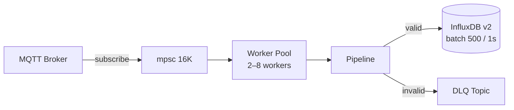

# smarthome-ingest

High-performance Rust microservice that ingests smart home telemetry from MQTT, validates it, and batch-writes it to InfluxDB v2. Invalid messages are routed to a Dead Letter Queue.


---

## Data Flow



---

## Pipeline

Each message passes through 8 sequential stages. Any failure skips to **DLQ**.

| # | Stage | What it does |
|---|-------|-------------|
| 1 | **Decode** | UTF-8 decode + JSON parse |
| 2 | **Validate Raw** | JSON schema + RFC3339 timestamp + optional topic/device_id match |
| 3 | **Transform** | Calculates `dew_point_c`, `heat_index_c`, `iaq_score`, `iaq_text`; validates sensor bounds |
| 4 | **Validate Business** | Post-transform schema validation |
| 5 | **Cache Update** | Stores latest device state in TTL-based in-memory cache |
| 6 | **Persist** | Converts to InfluxDB line protocol and enqueues to batcher |
| 7 | **Observe** | Records Prometheus metrics + structured logs |
| 8 | **DLQ** | On failure: publishes to DLQ topic with error context |

---

## Configuration

All config via environment variables.

### MQTT

| Variable | Default | Notes |
|----------|---------|-------|
| `MQTT_HOST` | `nanomq` | |
| `MQTT_PORT` | `1883` | |
| `MQTT_CLIENT_ID` | — | Required |
| `MQTT_USERNAME` | — | Optional |
| `MQTT_PASSWORD` | — | Optional |
| `MQTT_TOPIC_SENSOR` | — | Topic pattern for sensor messages |
| `MQTT_TOPIC_STATUS` | — | Topic pattern for status messages |
| `DLQ_TOPIC` | `smarthome/_dlq/ingest` | |

### InfluxDB

| Variable | Default | Notes |
|----------|---------|-------|
| `INFLUX_URL` | `http://influxdb:8086` | |
| `INFLUX_ORG` | `smarthome` | |
| `INFLUX_BUCKET` | `sensors` | |
| `INFLUX_TOKEN` | — | **Required** |
| `BATCH_SIZE` | `500` | Max points per write |
| `FLUSH_INTERVAL_MS` | `1000` | Max ms before flush |

### Service

| Variable | Default | Notes |
|----------|---------|-------|
| `ENFORCE_TOPIC_DEVICE_MATCH` | `true` | Validates `device_id` against MQTT topic |
| `METRICS_BIND` | `0.0.0.0:9090` | Prometheus endpoint |
| `CACHE_BIND` | `0.0.0.0:8080` | Latest device state HTTP API |
| `CACHE_TTL_MS` | — | Required |
| `CACHE_BUFFER` | — | Max cache entries |

---

## Quick Start

```bash
# Local
export INFLUX_TOKEN="your_token"
export MQTT_CLIENT_ID="dev"
cargo run --release
```

```bash
# Docker
docker build -t smarthome-ingest .
docker run -d \
  -e INFLUX_TOKEN="your_token" \
  -e INFLUX_URL="http://influxdb:8086" \
  -e MQTT_HOST="mqtt-broker" \
  -e MQTT_CLIENT_ID="ingest" \
  smarthome-ingest
```

---

## Observability

Prometheus metrics at `http://<METRICS_BIND>/metrics` — key metrics:

- `mqtt_messages_received_total`
- `ingest_incoming_non_utf8_total` / `ingest_incoming_invalid_json_total`
- `dlq_messages_published_total` / `dlq_publish_errors_total`

Latest device state available at `http://<CACHE_BIND>/` (TTL-evicted).

---

## Development

```bash
cargo build --release
cargo test --all-features --locked
cargo fmt --all --check
cargo clippy --all-targets --all-features --locked -- -D warnings
```
