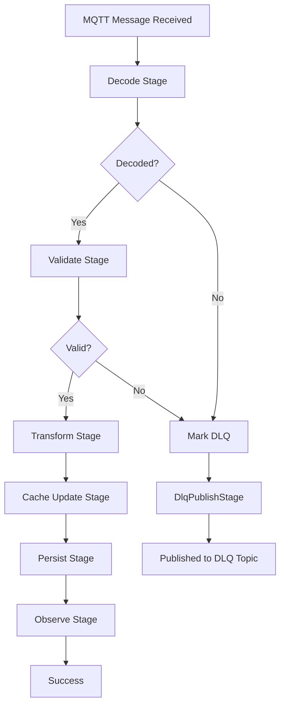

# smarthome-ingest

A high-performance Rust microservice to ingest smarthome telemetry and device statuses from an MQTT broker, validate the data, and batch-insert it into InfluxDB v2. Invalid data is automatically diverted to a Dead Letter Queue (DLQ) topic on the MQTT broker.

## Features

- **MQTT Integration**: Subscribes to configured MQTT topics via `rumqttc`.
- **JSON Schema Validation**: Validates incoming messages strictly against defined `.schema.json` files for sensors and status messages.
- **Dead Letter Queue (DLQ)**: Invalid payloads (e.g. non-UTF-8, malformed JSON, schema mismatch) are cleanly diverted to a DLQ topic.
- **InfluxDB Batching**: Converts valid JSON inputs to InfluxDB Line Protocol points and batches them for high-throughput writes. 
- **Prometheus Metrics**: Exposes metrics natively on a dedicated bind address (default `:9090/metrics`) for observability.

## Schemas & Routing

Incoming messages are routed and validated based on their topic.

- `schema/sensor.schema.json` - Describes the payload structure for sensor telemetry (e.g., BME680).
- `schema/status.schema.json` - Describes the payload structure for general device status updates.

If `ENFORCE_TOPIC_DEVICE_MATCH` is set to `true`, the ingestion service ensures that the `{device_id}` included in the JSON payload matches the MQTT topic it arrived on.

## Configuration

The service is fully configured via environment variables.

| Environment Variable | Description | Default |
| --- | --- | --- |
| `MQTT_HOST` | Hostname of the MQTT broker. | `nanomq` |
| `MQTT_PORT` | Port of the MQTT broker. | `1883` |
| `MQTT_USERNAME` | (Optional) Username for MQTT authentication. | |
| `MQTT_PASSWORD` | (Optional) Password for MQTT authentication. | |
| `MQTT_CLIENT_ID` | Unique Client ID for the MQTT connection. | `smarthome-ingest-<unix_timestamp>` |
| `MQTT_TOPIC` | Topic pattern to subscribe to for sensor telemetry. | `smarthome/+/bme680` |
| `DLQ_TOPIC` | Topic pattern to publish invalid/failed messages. | `smarthome/_dlq/ingest` |
| `INFLUX_URL` | Base URL of the InfluxDB v2 API. | `http://influxdb:8086` |
| `INFLUX_ORG` | InfluxDB Organization string. | `smarthome` |
| `INFLUX_BUCKET` | InfluxDB Bucket string to push data into. | `sensors` |
| `INFLUX_TOKEN` | **[Required]** InfluxDB API token with write permissions. | |
| `BATCH_SIZE` | Maximum number of data points to accumulate before writing to Influx. | `500` |
| `FLUSH_INTERVAL_MS` | Maximum amount of time (in milliseconds) to wait before flushing the current payload batch to InfluxDB. | `1000` |
| `ENFORCE_TOPIC_DEVICE_MATCH`| Ensure the `device_id` in the JSON payload matches the topic. | `true` |
| `METRICS_BIND` | Bind address/port for the Prometheus metrics server. | `0.0.0.0:9090` |
| `RUST_LOG` | Log level (e.g., `info`, `debug`, `error`). | `info` (via env-filter) |

## Observability & Metrics

A Prometheus-compatible endpoint is available at `http://<METRICS_BIND>/metrics`. It emits tracking details around ingest pipeline throughput, MQTT state, DLQ routing hits, and validation failures.

**Key Metrics Include**:
* `mqtt_messages_received_total`
* `ingest_incoming_non_utf8_total`
* `ingest_incoming_invalid_json_total`
* `dlq_messages_published_total`
* `dlq_publish_errors_total`

## Building and Running

### Running Locally

Ensure that you have an MQTT broker and InfluxDB instance available. 

```bash
export INFLUX_TOKEN="your_token_here"
export MQTT_HOST="localhost"
cargo run --release
```

### Building with Docker

A multi-stage `Dockerfile` is included. To build the container image:

```bash
docker build -t smarthome-ingest .
```

To run the container:

```bash
docker run -d \
  -e INFLUX_TOKEN="your_token" \
  -e INFLUX_URL="http://influxdb:8086" \
  -e MQTT_HOST="mqtt-broker" \
  smarthome-ingest
```

## Architecture

The smarthome-ingest service uses a modular pipeline architecture to process incoming MQTT messages asynchronously. Messages are received from the MQTT broker and processed through a series of stages in a worker pool. Each stage performs a specific function, and failures are handled by diverting messages to a Dead Letter Queue (DLQ).

### Pipeline Stages

1. **Decode Stage (`src/pipeline/stages/decode.rs`)**: Converts the raw MQTT payload (bytes) into a UTF-8 string and parses it as JSON. If decoding fails (e.g., invalid UTF-8 or malformed JSON), the message is marked for DLQ.

2. **Validate Stage (`src/pipeline/stages/validate.rs`)**: Validates the JSON payload against the appropriate JSON schema based on the message type (sensor or status). It also checks topic-device matching if enabled. Invalid payloads are marked for DLQ.

3. **Transform Stage (`src/pipeline/stages/transform.rs`)**: Converts the validated JSON into InfluxDB Line Protocol format, preparing it for database insertion.

4. **Cache Update Stage (`src/pipeline/stages/cache_update.rs`)**: Updates an in-memory cache with the latest device states for quick HTTP-based queries.

5. **Persist Stage (`src/pipeline/stages/persist.rs`)**: Sends the transformed data points to the InfluxDB batcher for asynchronous writing to the database.

6. **Observe Stage (`src/pipeline/stages/observe.rs`)**: Records metrics and logs for monitoring pipeline performance and throughput.

### Failure Handling

If any stage fails, the pipeline stops processing that message and marks it for DLQ. The DLQ Publish Stage (`src/pipeline/stages/dlq.rs`) then publishes the failed message with error context to the configured DLQ MQTT topic.

### Asynchronous Processing

- **Worker Pool**: Multiple worker tasks process messages concurrently from a shared queue.
- **Batching**: Data points are batched before writing to InfluxDB to optimize throughput.
- **Metrics**: Prometheus metrics are exposed for observability.

### Architecture Diagram


